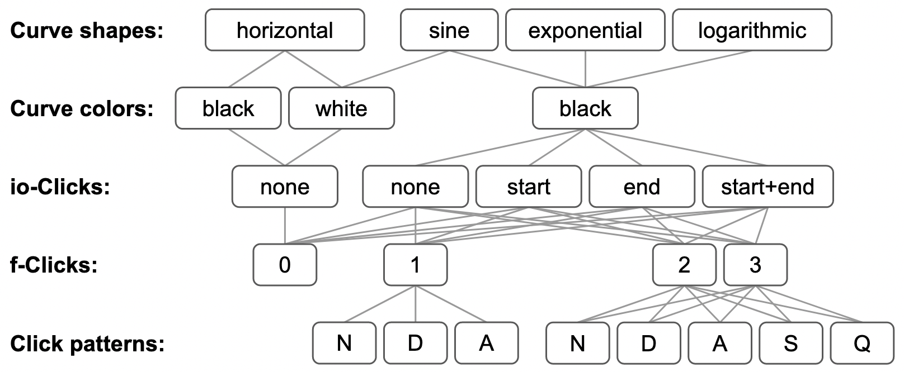
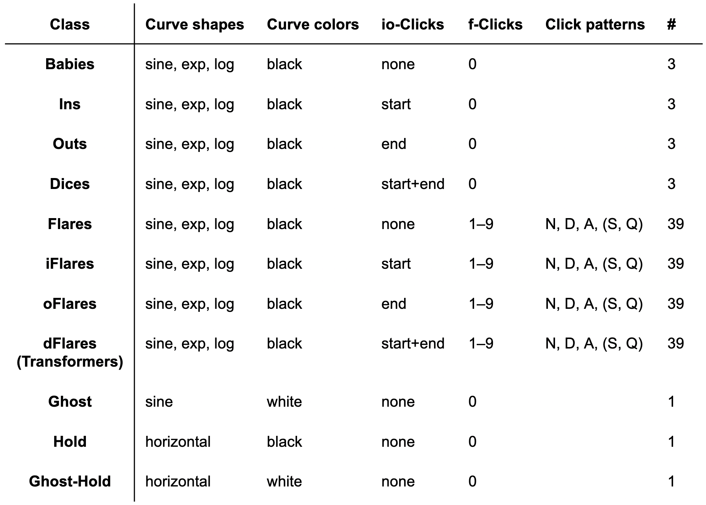

  <head>
    <title>ScratchBook</title>
    <!-- Standard stuff -->
    <meta charset="utf-8">
    <meta name="viewport" content="width=device-width, initial-scale=1">
    <!-- PyScript -->
    
    <link rel="stylesheet" href="https://pyscript.net/alpha/pyscript.css"/>
    <py-env>
      - matplotlib
    </py-env>
    <!-- Bootstrap 5.1.3 -->
    
    <link href="https://cdn.jsdelivr.net/npm/bootstrap@5.1.3/dist/css/bootstrap.min.css" rel="stylesheet">
    <link rel="stylesheet" type="text/css" href="https://cdnjs.cloudflare.com/ajax/libs/twitter-bootstrap/5.1.3/css/bootstrap.min.css">
    <!-- JQuery -->
    
    <!-- Datatables -->
    
    
    <link rel="stylesheet" type="text/css" href="https://cdn.datatables.net/1.12.1/css/dataTables.bootstrap5.min.css">
    <!-- Global Styling -->
    
  </head>
  <body style="background-color:var(--grey-light);">
    <header style="background-color:rgb(33, 37, 41);box-shadow:0px 4px 3px -1px var(--grey-dark)">
      

        <h1>ScratchBook &#128221;&#127926;</h1>
        
A platform for browsing, composing and visualizing scratches in <a class="dark-link" href="https://en.wikipedia.org/wiki/Turntablist_transcription_methodology" target='_blank'>TTM-like notation.</a>

        
&#9888; Loading the page takes time. Please be patient until you see the scratch plot.

      

    </header>
     
    <!-- Visualizer -->
    

      

        

          
<h4>Visualizer</h4>

          

            
Type and visualize your scratch formula...

            <input 
              id="scratch_input"
              class="form-control" 
              type="text" 
              placeholder="Type formula and press ENTER"/>
            

              <button 
                id="copy_button" 
                class="mybuttons"
                title="Copy url+formula and share it with your friends">
                Copy
              </button>
              <button 
                id="download_button"
                class="mybuttons"
                title="Download png image">
                Download
              </button> 
              <button 
                id="clear_button"
                class="mybuttons"
                title="Clear the input field">
                Clear
              </button>
              <button 
                id="default_button"
                class="mybuttons"
                title="Reset to default scratch formula">
                Default
              </button>  
              <button 
                id="surprise_button"
                class="mybuttons"
                title="Pick a scratch at random (currently limited to the Combos collection)">
                Surprise!
              </button>            
              <button 
                id="scratch_button" 
                type="submit" 
                style="border: none; background-color:rgba(255, 255, 255, 0);"
                pys-onClick="plot" >
              </button> 
            

            

            

            

            

              

                

                  <a 
                    class="btn btn-sm" 
                    data-bs-toggle="collapse" 
                    href="#InfoCard" 
                    title="Show detailed stats about your composition" 
                    style="width: 100%; text-align: left; font-size: 16px; font-weight: 500;">
                    Analyze your composition...
                  </a>
                

                

                  

                    

                      The following tables tell you how many sounds your composition makes, how many elements and popular scratches it contains, which types of clicks and curves are involved, and much more.
                    

                    

                      
Basic Info

                      <table id="info_basic" class="table info_table">
                        <thead><tr id="info_basic_thead">                          
                          <td title="Number of DISTINCT SOUNDS the composition makes">Sounds</td>
                          <td title="Number of ELEMENTARY SCRATCHES in the composition">Elements</td>
                          <td title="Number of TEARS in the composition">Tears</td>
                          <td title="Number of ORBITS in the composition">Orbits</td>
                        </tr></thead>
                        <tbody id="info_basic_tbody"></tbody>
                      </table>
                    

                    

                      
Clicks and Curves

                      <table id="info_curves_clicks" class="table info_table">
                        <thead><tr id="info_curves_clicks_thead">
                          <td title="Number of times the FADER is OPENED in the composition">FO</td>
                          <td title="Number of times the FADER is CLOSED in the composition">FC</td>
                          <td title="Number of times the PHANTOM-FADER is OPENED in the composition">PO</td>
                          <td title="Number of times the PHANTOM-FADER is CLOSED in the composition">PC</td>
                          <td title="Number of DIMINISHED click patterns in the composition">D</td>
                          <td title="Number of AUGMENTED click patterns in the composition">A</td>
                          <td title="Number of STRETCHED click patterns in the composition">S</td>
                          <td title="Number of SQUEEZED click patterns in the composition">Q</td>
                          <td title="Number of EXPONENTIAL curves in the composition">Ex</td>
                          <td title="Number of LOGARITHMIC curves in the scratch">Log</td>
                        </tr></thead>
                        <tbody id="info_curves_clicks_tbody"></tbody>
                      </table>
                    

                    

                      
Elements

                      <table id="info_elements" class="table info_table">
                        <thead><tr id="info_elements_thead">                          
                          <td title="Number of BABIES in the composition">Babies</td>
                          <td title="Number of INS in the composition">Ins</td>
                          <td title="Number of OUTS in the composition">Outs</td>
                          <td title="Number of DICES in the composition">Dices</td>
                          <td title="Number of FLARES in the composition">Flares</td>
                          <td title="Number of iFLARES in the composition">iFlares</td>
                          <td title="Number of oFLARES in the composition">oFlares</td>
                          <td title="Number of TRANSFORMERS in the composition">Transformers</td>
                          <td title="Number of GHOSTS in the composition">Ghosts</td>
                          <td title="Number of HOLDS in the composition">Holds</td>
                          <td title="Number of G-HOLDS in the composition">G-Holds</td>
                        </tr></thead>
                        <tbody id="info_elements_tbody"></tbody>
                      </table>
                    

                    

                      
Orbits

                      <table id="info_orbits" class="table info_table">
                        <thead><tr id="info_orbits_thead">
                          <td title="Number of CHIRPS in the composition">Chirps</td>
                          <td title="Number of SLICES in the composition">Slices</td>
                          <td title="Number of STABS in the composition">Stabs</td>
                          <td title="Number of FLARE-ORBITS in the composition">Flare-Orbits</td>
                          <td title="Number of OG-FLARES in the composition">OG-Flares</td>
                          <td title="Number of BABY-ORBITS in the composition">Baby-Orbits</td>
                          <td title="Number of DICE-ORBITS in the composition">Dice-Orbits</td>
                          <td title="Number of OFF-STABS in the composition">Off-Stabs</td>
                        </tr></thead>
                        <tbody id="info_orbits_tbody"></tbody>
                      </table>
                    

                    

                      
Orbit Types

                      <table id="info_orbit_types" class="table info_table">
                        <thead><tr id="info_orbit_types_thead">
                          <td title="Number of S-CURVED ORBITS in the composition">S-Curved</td>
                          <td title="Number of TAZER ORBITS in the composition">Tazers</td>
                          <td title="Number of PHANTAZM ORBITS in the composition">Phantazms</td>
                          <td title="Number of EX-TAZER ORBITS in the composition">Ex-Tazers</td>
                          <td title="Number of EX-PHANTAZM ORBITS in the composition">Ex-Phantazms</td>
                        </tr></thead>
                        <tbody id="info_orbit_types_tbody"></tbody>
                      </table>
                    

                  

                

              

            

            
          

        

      

       
    

     
    <!-- Library -->
    

      

        

          

            <h4>Library</h4>
          

          

            
ScratchBook lets you write TTM-notation just like math. Combine <strong>scratches</strong> and <strong>operators</strong> into formulas, such as: <code style="color: var(--blue-dark)">autobahn + prizm + (slice / 0.25) * 4</code>

            
Open the cards to learn more...

          

          <!-- Scratches -->
          

            

              <a 
                class="btn" 
                data-bs-toggle="collapse" 
                href="#ScratchCard" 
                title="Show ScratchBook's LIBRARY OF SCRATCHES"
                style="width: 100%; text-align: left; font-size: 18px; font-weight: 500;">
                Scratches
              </a>
            

            

              

                

                  In principle, <strong>you can compose almost any scratch</strong> out of ScratchBook's <strong>elements</strong> and <strong>operators</strong> and with the help of ScratchBook's special <strong>tear and orbit sub-languages</strong>.
                

                

                  But ScratchBook also provides a <strong>library of pre-composed scratches</strong>, which you can browse here.
                

                

                  Use the <strong>"Expert Mode"</strong> to show more geeky colums, to filter scratches, and to switch additional collections on and off.
                

                

                  

                    <a 
                      class="btn btn-sm" 
                      data-bs-toggle="collapse" 
                      href="#ExpertCard" 
                      title="Show EXPERT CONTROLS" 
                      style="width: 100%; text-align: left; font-size: 14px; font-weight: 500;">
                      Expert Mode
                    </a>
                  

                  
                  

                    <!-- Switches for collections -->
                    

                      

                        
Collections

                      

                      

                        

                          <label class="switch"><input id="CORE" type="checkbox" checked/></label>
                        

                        

                          <label class="switch"><input id="ELEMENTS" type="checkbox"/></label>
                        

                        

                          <label class="switch"><input id="TEARS" type="checkbox"/></label>
                        

                        

                          <label class="switch"><input id="ORBITS" type="checkbox"/></label>
                        

                        

                          <label class="switch"><input id="COMBOS" type="checkbox"/></label>
                        

                      

                      

                        
Core

                        
Elements

                        
Tears

                        
Orbits

                        
Combos

                      

                    

                    <!-- Switches Clicks -->
                    

                      

                        
Clicks

                      

                      

                        

                          <label class="switch"><input id="RegularClicks" type="checkbox"/></label>
                        

                        

                          <label class="switch"><input id="IrregularClicks" type="checkbox"/></label>
                        

                      

                      

                        
Regular

                        
Irregular

                      
                  
                    

                    <!-- Switches for Curves -->
                    

                      

                        
Curves

                      

                      

                        

                          <label class="switch"><input id="RegularCurves" type="checkbox"/></label>
                        

                        

                          <label class="switch"><input id="IrregularCurves" type="checkbox"/></label>
                        

                      

                      

                        
Regular

                        
Irregular

                      
                  
                    

                    <!-- Switches for columns -->
                    

                      

                        
Columns

                      

                      

                        

                          <label class="switch"><input id="Clicks" type="checkbox"/></label>
                        

                        

                          <label class="switch"><input id="Curves" type="checkbox"/></label>
                        

                        

                          <label class="switch"><input id="Scratches" type="checkbox"/></label>
                        

                      

                      

                        
Clicks

                        
Curves

                        
Scratches

                      
                  
                    

                  

                

                <!-- Style tooltips for all switches: -->
                
                <!-- DataTable -->
                <!-- <table class="table scratch_table" id="scratch_table" style="font-size: 12px; background-color: var(--grey-light)"></table> -->
                <table class="table scratch_table" id="scratch_table"></table>
                
              

            

          

          <!-- Operators -->
          

            

              <a 
                class="btn" 
                data-bs-toggle="collapse" 
                href="#OperatorCard" 
                title="Show ScratchBook's OPERATORS"
                style="width: 100%; text-align: left; font-size: 18px; font-weight: 500;">
                Operators
              </a>
            

            

              

                
<strong>Operators</strong> can be used <strong>to modify and combine scratches</strong>. The following table lists and explains all available operators.
                

                <table class="table" id="OperatorTable" style="font-size: 12px">
                  <thead>
                    <tr>
                        <th>Operator</th>
                        <th>Purpose</th>
                        <th>Grammar</th>
                        <th>Example</th>
                    </tr>
                  </thead>
                  <tbody>
                    <tr>
                        <td>~</td>
                        <td>"Reverse" or "backwards" scratching (Flip a scratch on the y-axis)</td>
                        <td>~scratch</td>
                        <td>~autobahn</td>
                    </tr>
                    <tr>
                        <td>-</td>
                        <td>"Mirror" scratching (Flip a scratch on the x-axis)</td>
                        <td>-scratch</td>
                        <td>-autobahn</td>
                    </tr>
                    <tr>
                        <td>*</td>
                        <td>Repeat a scratch <em>n</em> times (<em>n</em> must be an integer number)</td>
                        <td>scratch * <em>n</em></td>
                        <td>chirp * 4</td>
                    </tr>
                    <tr>
                        <td>+</td>
                        <td>Add scratches from left to right</td>
                        <td>scratch + scratch</td>
                        <td>chirp + flob2 + steps</td>
                    </tr>
                    <tr>
                        <td>/</td>
                        <td>Set the length <em>n</em> of a scratch in 1/4 notes (aka beats)</td>
                        <td>scratch / <em>n</em></td>
                        <td>baby / 2</td>
                    </tr>
                    <tr>
                        <td>//</td>
                        <td>Decide how much of the sample is used (<em>n</em> must be between 0 and 1)</td>
                        <td>scratch // <em>n</em></td>
                        <td>swingflare // 0.2</td>
                    </tr>
                    <tr>
                        <td>**</td>
                        <td>Move a scratch or expression up on the Y-axis. Typically used in connection with the "//" Operator". Use brackets wisely! For example, "chirp // 0.5 ** 0.5" is not the same as "(chirp // 0.5) ** 0.5".</td>
                        <td>expression ** <em>n</em></td>
                        <td>(chirp // 0.5) ** 0.5</td>
                    </tr>
                    <tr>
                        <td>%</td>
                        <td>Shift the "phase" of a scratch by rotating its elements from right to left. (<em>n</em> must be an integer number)</td>
                        <td>scratch % <em>n</em></td>
                        <td>prizm % 0.25</td>
                    </tr>
                    <tr>
                        <td>[<em>n</em>]</td>
                        <td>Show the <em>n</em>-ths element of a composed scratch (<em>n</em> must be an integer number. &#9888; Counting starts at 0 not at 1!)</td>
                        <td>scratch[<em>n</em>]</td>
                        <td>autobahn[3]</td>
                    </tr>
                    <tr>
                        <td>[<em>n</em>:<em>m</em>]</td>
                        <td>Show all elements between the <em>n</em>-ths (included) and <em>m</em>-ths (excluded) element of a composed scratch (<em>n</em> and <em>m</em> must be integer numbers. &#9888; Counting starts at 0 not at 1!)</td>
                        <td>scratch[<em>n</em>:<em>m</em>]</td>
                        <td>autobahn[3:7]</td>
                    </tr>
                    <tr>
                        <td>(<em>expression</em>)</td>
                        <td>Use (nested) brackets to logically "shield off" expressions from each other. For example, "chirp / 1/3" is not the same as "chirp / (1/3)". Brackets are essential for many complex expressions.</td>
                        <td>(<em>expression</em>)</td>
                        <td>(chirp // (1/3)) ** (2/3)</td>
                    </tr>
                  </tbody>
                </table>
              

            

          

        

      

       
    

     
    <!-- Theory -->
    

      

        

          

            <h4>Theory</h4>
          

          

            

              ScratchBook builds on two theoretical pillars: A theory of <strong>scratch notation</strong> and a theory of <strong>scratch elements</strong>.
            

            
Open the cards to learn more...

          

          <!-- Notation -->
          

            

              <a 
                class="btn" 
                data-bs-toggle="collapse" 
                href="#NotationCard" 
                title="Show information about ScratchBook's NOTATION"
                style="width: 100%; text-align: left; font-size: 18px; font-weight: 500;">
                Notation
              </a>
            

            

              

                
 
                  The <a href="https://en.wikipedia.org/wiki/Turntablist_transcription_methodology" target='_blank'>turntablist transcription methodology (TTM)</a> was created and published by John Carluccio, Ithan Imboden, and Raymond Pirtle in the late 1990s. It is a system for transcribing any scratch as the graph of a function of time, on the x-axis, either vs. the roation of the record or vs. the duration of the sample, on the y-axis.
                

                <ul>
                  <li>When <strong>the curve moves up</strong> this means that the record moves forward. When <strong>the curve moves down</strong> the record moves down.</li>
                  <li>The <strong>steepness of the curve</strong> at any point signifies the speed of the record, which usually corresponds to the pitch of the sample (except when pitch control technologies are used). The faster the sample is played, the steeper the curve and vice versa.</li>
                  <li>When <strong>the curve forms a horizontal line</strong>, even for a very short period of time, this indicates that the record is held still and makes no sound. This occurs, for example, during a tear scratch and at the turning point of any orbit scratch.</li>
                  <li><strong>Circles on top of the curve</strong> signify "clicks", i.e. moments when the cross-fader is closed and re-opened in as little time as possible, causing small breaks in the sound.</li>
                </ul>
                
 
                  According to the original <a href="https://www.ttm-dj.com/TTMv1.1_Eng.pdf" target='_blank'>TTM-booklet</a>, TTM is emphatically <em>"an open source effort...Fight it, defend it, tweak it, trash it - all will assist its evolution"</em> (p.10). In this spirit, <strong>ScratchBook modifies the original TTM</strong> in the following way: 
                

                <ul>
                  <li><strong>The color white</strong> generally indicates that the <strong>fader is closed</strong>.</li>
                  <li>Consequently, <strong>white circles</strong> (<u>not black ones</u>) are used to represent <strong>regular fader clicks</strong>.</li>
                  <li><strong>When the cross fader is closed for a longer time period</strong>, e.g. when the record is brought back during the second half of a stab scratch, this is indicated by a <strong>white curve</strong>.</li>
                  <li><strong>No "phantom clicks"</strong> are used to indicate moments when the record is held still. However, for the geeks among you, the number of opening and closing "phantom clicks" is reported in the tables.</li>
                </ul>
              

            

          

          <!-- Elements -->
          

            

              <a 
                class="btn" 
                data-bs-toggle="collapse" 
                href="#ElementsCard" 
                title="Show information about ScratchBook's ELEMENTS"
                style="width: 100%; text-align: left; font-size: 18px; font-weight: 500;">
                Elements
              </a>
            

            

              

                
 
                  Under the hood, <strong>ScratchBook takes an atomistic approach to scratch notation</strong>. Any scratch curve is generated from a sequence of distinct building blocks, called <strong>elements</strong>, each of which exhibits a unique combination of <strong>"subatomic features"</strong>.  
                

                

                  The total number of elements depends on the number of subatomic features and the rules of their combination, i.e <strong>the "grammar"</strong>. ScratchBook considers <strong>five classes of features</strong>:
                

                <ul>
                  <li><strong>Curve shapes</strong> (horizontal, sine, exponential, logarithmic)</li>
                  <li><strong>Curve colors</strong> (black, white)</li>
                  <li><strong>io-Clicks</strong> (in/out-clicks), i.e. clicks at the start and/or at the end of a of a scratch ([], [0], [1], [0,1]])</li>
                  <li><strong>f-Clicks</strong> (flare-clicks), i.e. clicks somewhere in the middle of a scratch (0 - 3 clicks)</li>
                  <li><strong>Click patterns</strong> (normal, diminished, augmented, stretched, squeezed)</li>
                </ul> 
                

                  <strong>Not all of these features should be combined with each other</strong>. For example, since white curves always represents silent record movement, they should  never have any clicks at all, and, to keep things simple, when they are not horizontal (1 Ghost-Hold), they should always be sine (1 Ghost). Also, click patterns only ever make sense when a scratch has at least one f-click, whereby stretched and squeezed patterns only make sense when at least two f-clicks are given.
                

                

                  The following decision tree maps out <strong>ScratchBook's current grammar</strong>, which results in a total of <strong>170 elements</strong>:
                

                

                   
                

                

                  ScratchBook's element can be grouped into <strong>eleven classes of elements</strong> with the following <strong>distribution of subatomic features</strong>: 
                

                

                  
                

              

            

          

        

      

       
    

     
    <footer class="bg-dark text-center text-white">
      <!-- Grid container -->
      

        <section class="mb-4">
          <!-- Twitter -->
          <a class="btn btn-outline-light btn-floating m-1" href="https://twitter.com/arno_simons" target='_blank' role="button"
            ><svg xmlns="http://www.w3.org/2000/svg" width="16" height="16" fill="currentColor" class="bi bi-twitter" viewBox="0 0 16 16"><path d="M5.026 15c6.038 0 9.341-5.003 9.341-9.334 0-.14 0-.282-.006-.422A6.685 6.685 0 0 0 16 3.542a6.658 6.658 0 0 1-1.889.518 3.301 3.301 0 0 0 1.447-1.817 6.533 6.533 0 0 1-2.087.793A3.286 3.286 0 0 0 7.875 6.03a9.325 9.325 0 0 1-6.767-3.429 3.289 3.289 0 0 0 1.018 4.382A3.323 3.323 0 0 1 .64 6.575v.045a3.288 3.288 0 0 0 2.632 3.218 3.203 3.203 0 0 1-.865.115 3.23 3.23 0 0 1-.614-.057 3.283 3.283 0 0 0 3.067 2.277A6.588 6.588 0 0 1 .78 13.58a6.32 6.32 0 0 1-.78-.045A9.344 9.344 0 0 0 5.026 15z"/></svg></a>
          <!-- Instagram -->
          <a class="btn btn-outline-light btn-floating m-1" href="https://www.instagram.com/dj_hdrs/" target='_blank' role="button"
            ><svg xmlns="http://www.w3.org/2000/svg" width="16" height="16" fill="currentColor" class="bi bi-instagram" viewBox="0 0 16 16"><path d="M8 0C5.829 0 5.556.01 4.703.048 3.85.088 3.269.222 2.76.42a3.917 3.917 0 0 0-1.417.923A3.927 3.927 0 0 0 .42 2.76C.222 3.268.087 3.85.048 4.7.01 5.555 0 5.827 0 8.001c0 2.172.01 2.444.048 3.297.04.852.174 1.433.372 1.942.205.526.478.972.923 1.417.444.445.89.719 1.416.923.51.198 1.09.333 1.942.372C5.555 15.99 5.827 16 8 16s2.444-.01 3.298-.048c.851-.04 1.434-.174 1.943-.372a3.916 3.916 0 0 0 1.416-.923c.445-.445.718-.891.923-1.417.197-.509.332-1.09.372-1.942C15.99 10.445 16 10.173 16 8s-.01-2.445-.048-3.299c-.04-.851-.175-1.433-.372-1.941a3.926 3.926 0 0 0-.923-1.417A3.911 3.911 0 0 0 13.24.42c-.51-.198-1.092-.333-1.943-.372C10.443.01 10.172 0 7.998 0h.003zm-.717 1.442h.718c2.136 0 2.389.007 3.232.046.78.035 1.204.166 1.486.275.373.145.64.319.92.599.28.28.453.546.598.92.11.281.24.705.275 1.485.039.843.047 1.096.047 3.231s-.008 2.389-.047 3.232c-.035.78-.166 1.203-.275 1.485a2.47 2.47 0 0 1-.599.919c-.28.28-.546.453-.92.598-.28.11-.704.24-1.485.276-.843.038-1.096.047-3.232.047s-2.39-.009-3.233-.047c-.78-.036-1.203-.166-1.485-.276a2.478 2.478 0 0 1-.92-.598 2.48 2.48 0 0 1-.6-.92c-.109-.281-.24-.705-.275-1.485-.038-.843-.046-1.096-.046-3.233 0-2.136.008-2.388.046-3.231.036-.78.166-1.204.276-1.486.145-.373.319-.64.599-.92.28-.28.546-.453.92-.598.282-.11.705-.24 1.485-.276.738-.034 1.024-.044 2.515-.045v.002zm4.988 1.328a.96.96 0 1 0 0 1.92.96.96 0 0 0 0-1.92zm-4.27 1.122a4.109 4.109 0 1 0 0 8.217 4.109 4.109 0 0 0 0-8.217zm0 1.441a2.667 2.667 0 1 1 0 5.334 2.667 2.667 0 0 1 0-5.334z"/></svg></a>
          <!-- Linkedin -->
          <a class="btn btn-outline-light btn-floating m-1" href="" target='_blank' role="button"
            ><svg xmlns="http://www.w3.org/2000/svg" width="16" height="16" fill="currentColor" class="bi bi-linkedin" viewBox="0 0 16 16"><path d="M0 1.146C0 .513.526 0 1.175 0h13.65C15.474 0 16 .513 16 1.146v13.708c0 .633-.526 1.146-1.175 1.146H1.175C.526 16 0 15.487 0 14.854V1.146zm4.943 12.248V6.169H2.542v7.225h2.401zm-1.2-8.212c.837 0 1.358-.554 1.358-1.248-.015-.709-.52-1.248-1.342-1.248-.822 0-1.359.54-1.359 1.248 0 .694.521 1.248 1.327 1.248h.016zm4.908 8.212V9.359c0-.216.016-.432.08-.586.173-.431.568-.878 1.232-.878.869 0 1.216.662 1.216 1.634v3.865h2.401V9.25c0-2.22-1.184-3.252-2.764-3.252-1.274 0-1.845.7-2.165 1.193v.025h-.016a5.54 5.54 0 0 1 .016-.025V6.169h-2.4c.03.678 0 7.225 0 7.225h2.4z"/></svg></a>
          <!-- Github -->
          <a class="btn btn-outline-light btn-floating m-1" href="https://github.com/arnosimons" target='_blank' role="button"
            ><svg xmlns="http://www.w3.org/2000/svg" width="16" height="16" fill="currentColor" class="bi bi-github" viewBox="0 0 16 16"><path d="M8 0C3.58 0 0 3.58 0 8c0 3.54 2.29 6.53 5.47 7.59.4.07.55-.17.55-.38 0-.19-.01-.82-.01-1.49-2.01.37-2.53-.49-2.69-.94-.09-.23-.48-.94-.82-1.13-.28-.15-.68-.52-.01-.53.63-.01 1.08.58 1.23.82.72 1.21 1.87.87 2.33.66.07-.52.28-.87.51-1.07-1.78-.2-3.64-.89-3.64-3.95 0-.87.31-1.59.82-2.15-.08-.2-.36-1.02.08-2.12 0 0 .67-.21 2.2.82.64-.18 1.32-.27 2-.27.68 0 1.36.09 2 .27 1.53-1.04 2.2-.82 2.2-.82.44 1.1.16 1.92.08 2.12.51.56.82 1.27.82 2.15 0 3.07-1.87 3.75-3.65 3.95.29.25.54.73.54 1.48 0 1.07-.01 1.93-.01 2.2 0 .21.15.46.55.38A8.012 8.012 0 0 0 16 8c0-4.42-3.58-8-8-8z"/></svg></a>
        </section>
        <section class="mb-4">
          
ScratchBook is an educational and non-commercial project. The <a class="dark-link" href="https://github.com/arnosimons/scratchbook" target='_blank'>underlying code</a> is free freely available and reusable under the GPL-3.0 license.

          
ScratchBook uses a slightly modified version of the <a class="dark-link" href="https://en.wikipedia.org/wiki/Turntablist_transcription_methodology" target='_blank'>turntablist transcription methodology (TTM)</a>, which was created and <a class="dark-link" href="https://www.ttm-dj.com/TTMv1.1_Eng.pdf" target='_blank'>published</a> by John Carluccio, Ithan Imboden, and Raymond Pirtle in the late 1990s. I am deeply indebted to their work.

          
  2022 by <a class="dark-link" href="https://arnosimons.github.io/" target='_blank'>Arno Simons</a>, a Berlin-based turntablist and researcher.

        </section>
      

    </footer>
  </body>
  <py-script>
    import re
    from js import XMLHttpRequest
    req = XMLHttpRequest.new()
    req.open("GET", "https://raw.githubusercontent.com/arnosimons/scratchbook/main/scratchbook.py", False)
    req.send()
    exec(str(req.response))
    req = XMLHttpRequest.new()
    req.open("GET", "https://raw.githubusercontent.com/arnosimons/scratchbook/main/codebook_new.json", False)
    req.send()
    exec(f"codebook = {req.response}")
    slice = makeScratch('i_o', codebook)  # workaround to avoid name collision with "slice"   
    <!-- pyscript.write("session_message", codebook['_2cf']) -->
    session_info = document.getElementById("session_info")
    info_basic = document.getElementById("info_basic_tbody")
    info_curves_clicks = document.getElementById("info_curves_clicks_tbody")
    info_elements = document.getElementById("info_elements_tbody")    
    info_orbits = document.getElementById("info_orbits_tbody")
    info_orbit_types = document.getElementById("info_orbit_types_tbody")    
    def plot(x=None):
        formula = Element("scratch_input").element.value
        if not formula:
            pyscript.write("session_output", "plot() requires a formula as input.")
            return
        try:
            myscratch = makeScratch(formula, codebook)
            info = getInfo(myscratch)
            fig = Session(myscratch, fontsize=11, w_pad=2).fig
            pyscript.write("session_output", fig)
            for body, keys in [
                [info_basic, ["Sounds", "Elements", "Tears", "Orbits"]],
                [info_curves_clicks, ["FO", "FC", "PO", "PC", "D", "A", "S", "Q", "Ex", "Log"]],
                [info_elements, ["Babies", "Ins", "Outs", "Dices", "Flares", "iFlares", "oFlares", "Transformers", "Ghosts", "Holds", "G-Holds"]],
                [info_orbits, ["Chirps", "Slices", "Stabs", "Flare-Orbits", "OG-Flares", "Baby-Orbits", "Dice-Orbits", "Off-Stabs"]],
                [info_orbit_types, ["S-Curved", "Tazers", "Phantazms", "Ex-Tazers", "Ex-Phantazms"]],
            ]:
                body.innerHTML = ""
                row = document.createElement('tr')
                for k in keys:
                    td = document.createElement('td')
                    td.innerHTML = info[k]
                    row.appendChild(td)
                    body.appendChild(row)
            session_info.style.display = "block"
        except Exception as e:
            pyscript.write("session_output", str(e))  
    plot()
  </py-script>